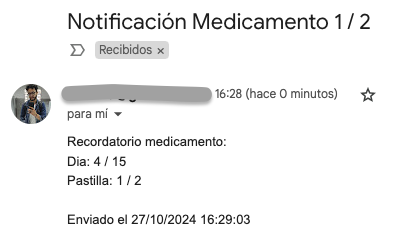
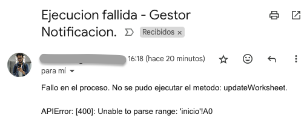

# Gestor de Notificaciones para Toma de Medicamentos

Este proyecto tiene como objetivo ayudar a los usuarios a recordar la toma de medicamentos de forma programada. Si bien está diseñado para esta función específica, el sistema puede adaptarse a otras necesidades de notificaciones regulares.

## ¿Cómo Funciona?

El programa utiliza una hoja de cálculo en Google Sheets para registrar las fechas y el estado de la toma de medicamentos. Dos veces al día, el programa revisa automáticamente la hoja de Google Sheets para verificar si el día actual se encuentra dentro del rango en el que el usuario debe tomar su medicamento. Si es así, se enviará una notificación para recordarle al usuario.

## Estructura del Proyecto

- Google Sheets: Contiene una tabla que registra el rango de fechas para la toma de medicamentos y otra donde almacena el log de notificaciones.
- Python: Un script en Python consulta esta tabla y envía notificaciones al usuario en los días programados.

## Personalización

Puedes ajustar los intervalos de notificación, añadir diferentes tipos de recordatorios y adaptar el sistema para otras tareas que requieran alertas diarias o programadas.

## Ejemplo de Configuración en Google Sheets

| Fecha Inicio | Fecha Fin  | Tomar Patillas | Activo |
| ------------ | ---------- | :------------: | :----: |
| 2024-10-01   | 2024-10-15 |       1        |   1    |
| 2024-10-16   | 2024-10-30 |       0        |   0    |

## Ejemplo Correos:

Tambien identifica cuando el proceso falla y manda un correo de error:

